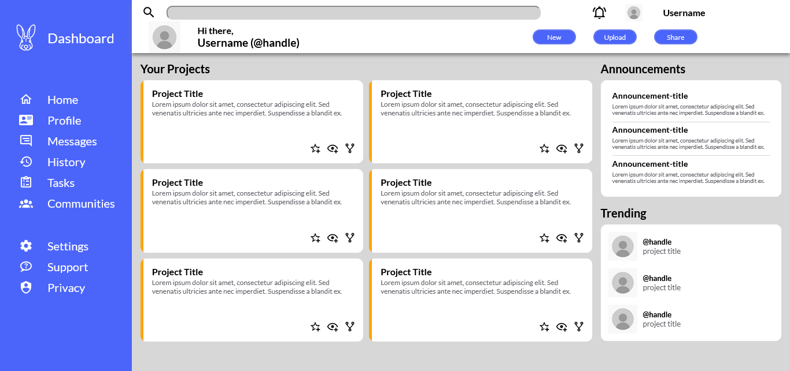

# Odin - Admin Dashboard

## This projects main purpose is to 'flex' the grid skills gained thus far from [The Odin Project](https://www.theodinproject.com/lessons/node-path-intermediate-html-and-css-admin-dashboard).

The project focuses on the visual aspects of the webpage in your standard desktop browser. All the TOP project requirements have been met, responsiveness is a personal goal and still in the works.

## [Live Demo](https://callmegig.github.io/Odin-AdminDashboard/)